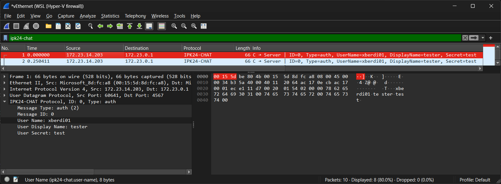
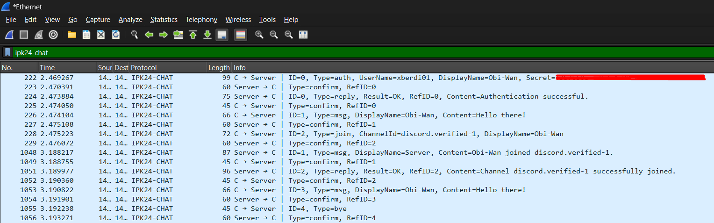
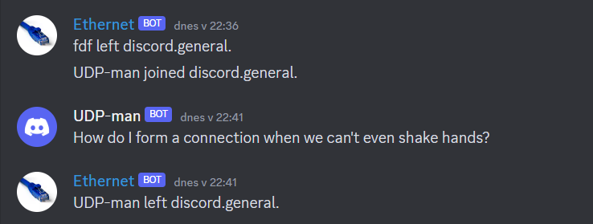
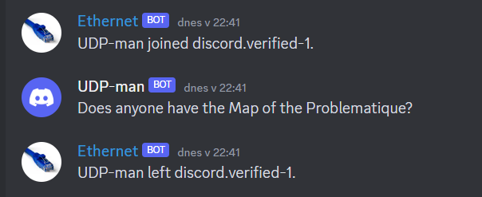

# IPK24_ChatClient
Author: Maroš Berdis (xberdi01) \
Date: 13.03.2024 \
License: GNU GENERAL PUBLIC LICENSE Version 3 \
[Assignment specification](https://git.fit.vutbr.cz/NESFIT/IPK-Projects-2024/src/branch/master/Project%201)

Chat client application written in ***C++***, using object oriented approach, that uses ***IPK24-CHAT*** protocol over ***IPv4*** to communicate with the server.

## Build & Run
Project uses ***Makefile*** to handle build. Available commands:
|Command             |Description           |
| ---                | -----------          |
|`make`              | creates ***ipk24chat-client*** executable in project directory |
|`make clean`        | cleans build-generated files |
|`make run`          | builds and runs the app |
|`make runValgrind`  | builds and runs the app using valgrind |
|`make runUdpServCon`| builds and runs the app, will use UDP and reference server in options |
|`make runTcpServCon`| builds and runs the app, will use TCP and reference server in options |

The program ***ipk24chat-client*** accepts following CLI arguments: \
(Table is inspired by the specification in [Assignment\CLI Arguments](https://git.fit.vutbr.cz/NESFIT/IPK-Projects-2024/src/branch/master/Project%201#user-content-cli-arguments))
|Argument | Default value | Accepted values | Description |
| ---     | -----------   | ---             | ----------- |
|`-t`     | User provided | `tcp` / `udp`   | Transport protocol used for connection|
|`-s`     | User provided | IP address or hostname	   | Chat server IP/hostname |
|`-p`     | 4567 | `uint16`	   | Server port |
|`-d`     | 250 | `uint16`	   | UDP confirmation timeout |
|`-r`     | 3 | `uint8`	   | max number of UDP retransmissions  |
|`-h`     | | | Prints program help and exits  |

The program reads user-typed commands from the standard input (`stdin`). Any other input is treated as a message and sent to the server. \
(Table is inspired by the specification in [Assignment\Client behaviour, input and commands](https://git.fit.vutbr.cz/NESFIT/IPK-Projects-2024/src/branch/master/Project%201#user-content-client-behaviour-input-and-commands))

|Command | Parameters | Description |
| ---     | --------  | ----------- |
|`/auth`  | `{username}` `{secret}` `{displayName}` | Tries to authorize user with the server |
|`/join`  | `{channelID}` | Tries to join channel |
|`/rename`  | `{displayName}` | Renames authorized user, will apply to newly sent messages |
|`/help`  | | Prints help about these commands  |

## Problematique
The `IPK24-chat` is built on top of well known transport protocols TCP [RFC9293] or UDP [RFC768]. Since TCP provides reliable delivery, its variant posses little to none challenge. Thus in this section we'll focus on making UDP's connection-less approach more reliable.
### 1. Packet loss
After each sent UDP message (confirm message excluded) we'll await mandatory confirmation message from the server. Lack of this message, within set timespan, will signal packet loss. In that case we'll sent that message again, maximally `udpRetry` amount of times. This limitation will solve the problem when the server is no longer online or the connection is so unreliable that we cannot deliver a single message.

### 2. Packet delay / duplication
To fix this issue we'll give each message a unique identifier. While processing incoming messages we have to check whether we're expecting confirmation message with given unique identifier. If not, discard the message.

## Implementation
Program needs to handle both the user input from the `stdin` and incoming messages from the socket. To adress this issue in the non-blocking manner `poll()` function is utilized (not `epoll()` because of the potential Windows support). Pseudocode that illustrate it's use in `main()`:
```cpp
while (!signal_received)    // while not interrupted
{
    // wait indefinitely until an event occurs
    poll(fds, nfds, -1);

    if (user_input) 
        process_user_input();

    if (socket_input)
        conPtr->receive_msg();
}
```

`poll()` is also used while waiting for ***REPLY*** or ***CONFIRM*** messages from the server. This time we're only checking for input from the socket, the user input will stack in the `stdin` and will be processed later in `main()`. Pseudocode that illustrates waiting for ***REPLY*** message:
```cpp
while (!signal_received)    // while not interrupted
{
    // wait REPLY_TIMEOUT ms until an event occurs
    poll(fds, 1, REPLY_TIMEOUT);

    if (socket_input)
    {
        switch (receive_msg())
        {
            case ERR: throw ClientException();
            case NOK: return;
            case OK:  return;
            default:  break;
        }
    }
}
```

### 1. Abstraction
`AbstractConnection` class serves as a base for both the TCP and UDP. It also defines a common interface for sending messages via a child connection that inherits it. 

### 2. Connection lifecycle
***Connection creation*** consists of invoking constructors in a cascading manner:
```
AbstractConnection => UDPConnection
AbstractConnection => TCPConnection
```

- `AbstractConnection`'s constructor handles the general initialization needed by both the TCP and UDP. It creates a socket and stores comunnication arguments (server info).
- `UDPConnection`'s constructor sets UDP retry and timeout arguments.
- `TCPConnection`'s constructor establishes TCP connection with the server.

***Connection termination*** works in an opposite order than its creation. 
```
~UDPConnection => ~AbstractConnection
~TCPConnection => ~AbstractConnection
```
- `UDPConnection`'s and `TCPConnection`'s destructors send their corresponding version of ***BYE*** message to the server.
- `AbstractConnection`'s destructor closes the socket.

> ***Warning!*** To ensure proper disposal of the connection object by the garbage collector, exceptions need to be caught within the main() function.


## Testing
1. Early prototyping
    - sending single TCP / UDP message to the loopback and inspecting it though the ***Wireshark*** to validate program's ability to send messages.
    
    > ***Warning!*** In order for ***Windows*** to capture packets sent by a client app run on ***Ubuntu WSL***, client needs to communicate on ***vEthernet (WSL (Hyper-V firewall)) address*** instead of a traditional `127.0.0.1` loopback.

2. While programming TCP
    - I've used *netcat* program to manually mock local ***IPK24-CHAT*** server.
    Client:
    ```
    anon@DESKTOP:/VUT_FIT/IPK/IPK24_Project1$ ./ipk24chat-client -t tcp -s 127.0.0.1
    Message without auth...
    ERR: Auth first!
    /auth test will fail
    Failure: Auth failed. Try again.
    /auth xberdi01 secret TCP-tester
    Success: Auth success.
    Hey! It worked.
    ^C
    ```
    Mocked server: \
    (Client messages are prefixed messages with '<' for better readability)
    ```
    anon@DESKTOP:/VUT_FIT/IPK/IPK24_Project1$ nc -4 -l -v 127.0.0.1 4567
    Listening on localhost 4567
    Connection received on localhost 49430
    < AUTH test AS fail USING will
    REPLY NOK IS Auth failed. Try again.
    < AUTH xberdi01 AS TCP-tester USING secret
    REPLY OK IS Auth success.
    < MSG FROM TCP-tester IS Hey! It worked.
    < BYE
    ```

3. While programming UDP
    - by inspecting outgoing messages send by the client via ***Wireshark***. Screenshot from full communication between the reference server and app:
    

4. Full app testing
    - manually by connecting to the reference server and then checking if messages are visible at the ***Discord server***.
    ```
    anon@DESKTOP:/VUT_FIT/IPK/IPK24_Project1$ ./ipk24chat-client -t udp -s anton5.fit.vutbr.cz
    /auth xberdi01 secret UDP-man
    Success: Authentication successful.
    Server: UDP-man joined discord.general.
    How do I form a connection when we can't even shake hands?
    /join discord.verified-1
    Server: UDP-man joined discord.verified-1.
    Success: Channel discord.verified-1 successfully joined.
    Does anyone have the Map of the Problematique?
    ^C
    ```
    Messages visible on the Discord server:\
    
    

    - by passing short text file to the program: 
    ```
    ./ipk24chat-client -t tcp -s anton5.fit.vutbr.cz < input.txt
    ```

## Sources
1. [Assignment specification](https://git.fit.vutbr.cz/NESFIT/IPK-Projects-2024/src/branch/master/Project%201)
2. [BUT FIT - IKP24 presentation on network programming](https://moodle.vut.cz/pluginfile.php/823898/mod_folder/content/0/IPK2023-24L-04-PROGRAMOVANI.pdf)
3. [Non-blocking operations using poll()](https://pubs.opengroup.org/onlinepubs/009696799/functions/poll.html)